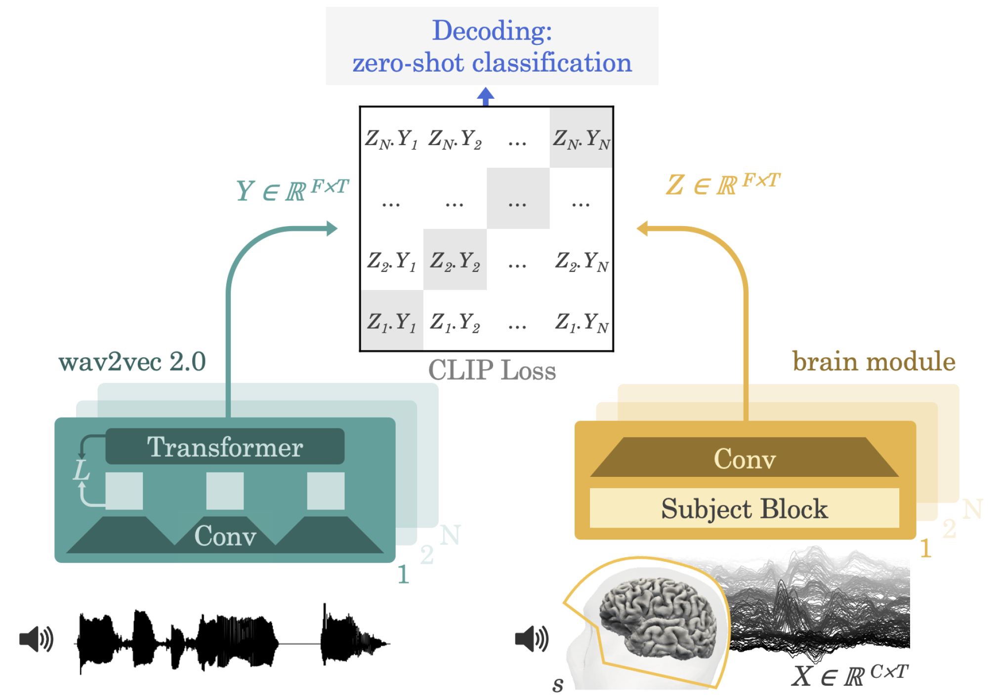

# Reimplementation of speech decoding paper by MetaAI

[Paper Link](https://arxiv.org/pdf/2208.12266.pdf)

<div align="center"></div>

## Status

Works for Gwilliams2022 dataset and Brennan2018 dataset.

## TODOs

- [ ] Achieve accuracies in the paper (Brennan -> Gwilliams).
- [ ] Reorganize Gwilliams dataclass to look more similar to Brennan (using Base class).

# Usage

```bash
conda create -n speech-decoding python=3.9
conda activate speech-decoding
pip install -r requirements.txt
pip install -e .
```

## For EEG (Brennan et al. 2018)

[Paper Link](https://journals.plos.org/plosone/article?id=10.1371/journal.pone.0207741)

Run `python train.py dataset=Brennan2018 rebuild_dataset=True`.
When `rebuild_dataset=False`, existing pre-processed M/EEG and pre-computing embeddings are used. This is useful if you want to run the model on exactly the same data and embeddings several times. Otherwise, the both audio embeddings are pre-computed and M/EEG data are pre-processed before training begins.

## For MEG (Gwilliams et al. 2022)

Run `python train.py dataset=Gwilliams2022 rebuild_dataset=True`
When `rebuild_dataset=False`, existing pre-processed M/EEG and pre-computing embeddings are used. This is useful if you want to run the model on exactly the same data and embeddings several times. It takes ~30 minutes to pre-process Gwilliams2022 and compute embeddings on 20 cores. Set `rebuild_dataset=False` for subsequent runs (or don't specify it, becuase by default `rebuild_dataset=False`). Otherwise, the both audio embeddings are pre-computed and M/EEG data are pre-processed before training begins.

## Monitoring training progress with W&B

To do that, set `entity` and `project` in the `wandb` section of `config.yaml`.

## Datasets

**Gwilliams et al., 2022**

- Paper https://arxiv.org/abs/2208.11488

- Dataset https://osf.io/ag3kj/

**Brennan et al., 2019**

- Paper https://journals.plos.org/plosone/article?id=10.1371/journal.pone.0207741

- Dataset https://deepblue.lib.umich.edu/data/concern/data_sets/bg257f92t

You will need `S01.mat` to `S49.mat` placed under `data/Brennan2018/raw/` and `audio.zip` unzipped to `data/Brennan2018/audio/` to run the code.
