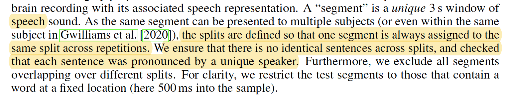

# Questions

- About "We ensure that there is no identical sentences across splits" below, can it be rephrased as "We ensure that there is no two segments across splits that are coming from the same sentence"?

- About "we restrict the test segments to those that contain a word at a fixed location (here 500ms into the sample)" below, can it be rephrased as "we dropped the test segments that don't contain any word until 500ms"? In that case why does it happend when we segment with word onsets?

- After wav2vec2.0 embedding, audios become something like 50Hz (because wav2vec2.0 requires them to be originally 16kHz and it downsamples them a lot), so we need to upsample them to match brains' 120Hz. Do you actually do that? If so, which method do you use? We've tried linear interpolation by torchaudio and zero-padding but neither worked well.

- Learnable temperature of CLIP loss was not mentioned and absent in equation (2). It was mentioned in the original CLIP paper but do you actually use it?

# Experiment results

## Brennan2018

- Basically couldn't achieve performance in the paper.

- Segmenting was done with word onsets.

- Split

  - Sentence
    - 80% sentences were assigned to train

  - Shallow
    - 3s segments were assigned to train (80%) / test (20%) randomly
    - meaning there are actual overlaps between train and test

  - Deep
    - first 80% minutes of each session were assigned to train

- Scaling

  - Global
    - Robust Scaler was applied globally
    - meaning a certain channel with huge noise level can affect other channels

  - Channel-wise
    - Robust Scaler was applied channel-wise

## Gwilliams2022
